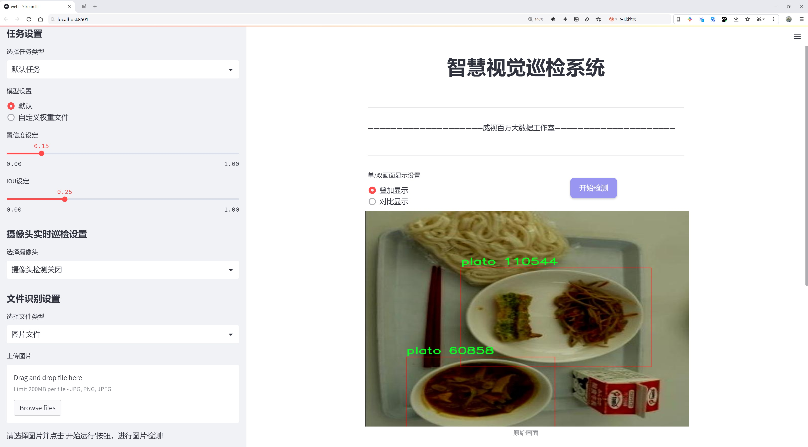
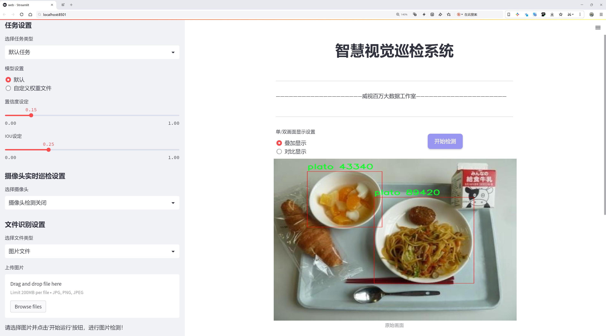
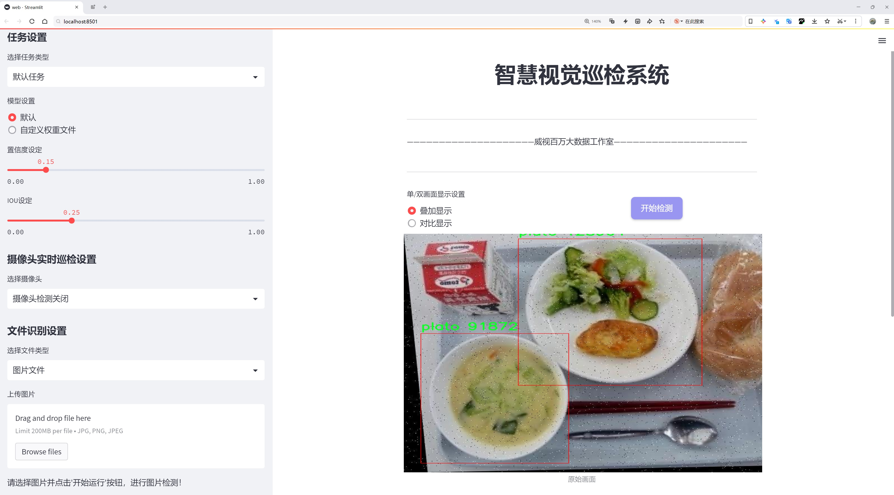
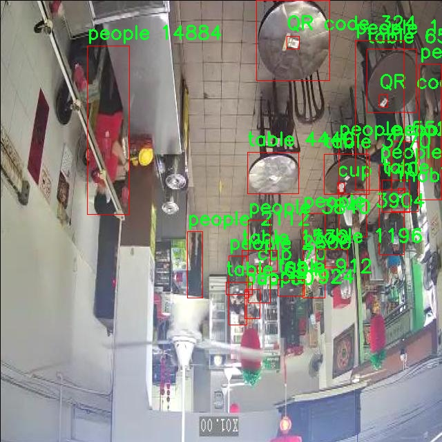
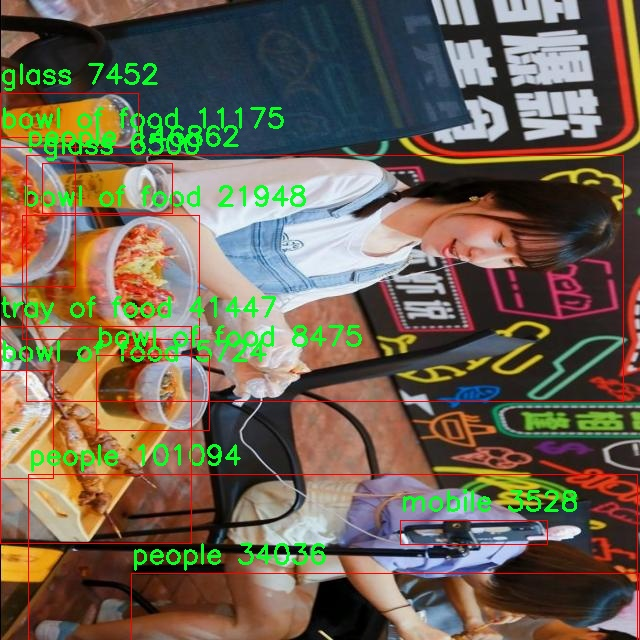
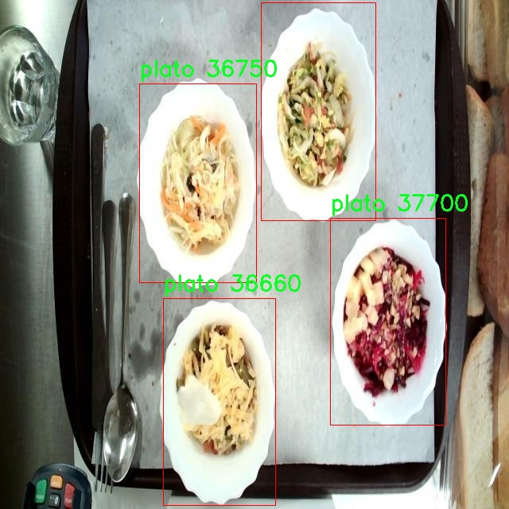
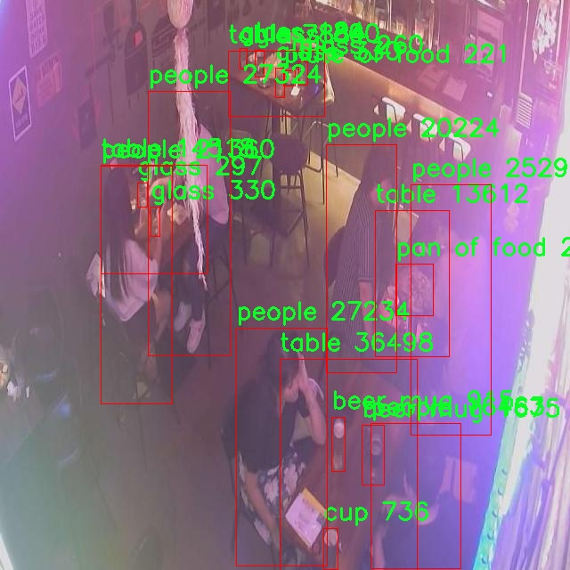
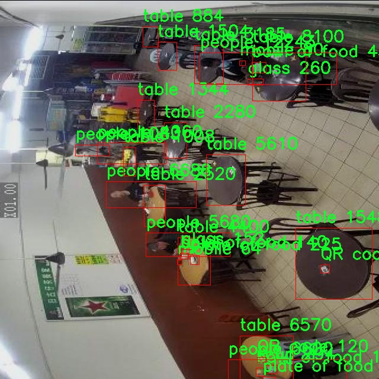

# 餐具与食品检测检测系统源码分享
 # [一条龙教学YOLOV8标注好的数据集一键训练_70+全套改进创新点发刊_Web前端展示]

### 1.研究背景与意义

项目参考[AAAI Association for the Advancement of Artificial Intelligence](https://gitee.com/qunmasj/projects)

项目来源[AACV Association for the Advancement of Computer Vision](https://kdocs.cn/l/cszuIiCKVNis)

研究背景与意义

随着社会经济的快速发展和人们生活水平的提高，餐饮行业的蓬勃发展使得食品安全和餐具管理成为了公众关注的焦点。餐饮服务的质量不仅直接影响消费者的用餐体验，也关系到食品安全、卫生和环境保护等多方面的问题。因此，构建一个高效、智能的餐具与食品检测系统显得尤为重要。近年来，计算机视觉技术的迅猛发展为这一领域提供了新的解决方案，尤其是基于深度学习的目标检测技术，如YOLO（You Only Look Once）系列模型，因其高效性和准确性而受到广泛关注。

YOLOv8作为YOLO系列的最新版本，具备了更强的实时检测能力和更高的检测精度，适用于多种复杂场景的目标识别任务。在餐饮行业中，应用YOLOv8进行餐具与食品的检测，不仅可以提升餐厅的运营效率，还能有效减少人为错误，提高食品安全管理水平。本研究旨在基于改进的YOLOv8模型，开发一个高效的餐具与食品检测系统，以实现对餐饮环境中各类物品的智能识别和管理。

本研究所使用的数据集包含2990张图像，涵盖了36个类别的物品，包括餐具（如刀、叉、勺、杯、盘等）和食品（如各类菜肴、饮料等），以及与餐饮环境相关的其他物品（如菜单、服务员、桌子等）。这一丰富的数据集为模型的训练和评估提供了坚实的基础。通过对这些类别的细致划分和准确标注，研究将能够实现对餐饮环境中各类物品的精准识别，从而为后续的智能管理提供数据支持。

在实际应用中，基于改进YOLOv8的检测系统可以帮助餐厅实现自动化的物品识别与管理。例如，系统可以实时监测餐桌上的餐具和食品，及时提醒服务员补充缺失的物品，减少顾客等待时间，提高服务质量。此外，系统还可以通过对餐具和食品的检测，自动生成用餐数据报告，为餐厅的运营决策提供数据支持。这种智能化的管理方式不仅提高了餐厅的运营效率，也为顾客提供了更为优质的用餐体验。

综上所述，基于改进YOLOv8的餐具与食品检测系统的研究，不仅具有重要的理论意义，也具备广泛的实际应用价值。通过该系统的开发与应用，可以有效提升餐饮行业的管理水平，推动餐饮服务的智能化进程，最终实现食品安全与顾客满意度的双重提升。因此，本研究的开展具有重要的学术价值和社会意义，期待能够为餐饮行业的智能化转型提供有力的技术支持。

### 2.图片演示







##### 注意：由于此博客编辑较早，上面“2.图片演示”和“3.视频演示”展示的系统图片或者视频可能为老版本，新版本在老版本的基础上升级如下：（实际效果以升级的新版本为准）

  （1）适配了YOLOV8的“目标检测”模型和“实例分割”模型，通过加载相应的权重（.pt）文件即可自适应加载模型。

  （2）支持“图片识别”、“视频识别”、“摄像头实时识别”三种识别模式。

  （3）支持“图片识别”、“视频识别”、“摄像头实时识别”三种识别结果保存导出，解决手动导出（容易卡顿出现爆内存）存在的问题，识别完自动保存结果并导出到tempDir中。

  （4）支持Web前端系统中的标题、背景图等自定义修改，后面提供修改教程。

  另外本项目提供训练的数据集和训练教程,暂不提供权重文件（best.pt）,需要您按照教程进行训练后实现图片演示和Web前端界面演示的效果。

### 3.视频演示

[3.1 视频演示](https://www.bilibili.com/video/BV14ps6e2Ex7/)

### 4.数据集信息展示

##### 4.1 本项目数据集详细数据（类别数＆类别名）

nc: 36
names: ['QR code', 'bag', 'bag with straw', 'basket of food', 'beer mug', 'blue QR code', 'bottle', 'bowl of food', 'chopstick', 'cook', 'cup', 'dish', 'fork', 'glass', 'jug', 'knife', 'masa', 'menu', 'mobile', 'napkin', 'om', 'pan of food', 'people', 'pepper', 'plate of food', 'plato', 'salt', 'scaun', 'soda can', 'spoon', 'table', 'tablou', 'tray of food', 'vase with flower', 'waiter', 'wine glass']


##### 4.2 本项目数据集信息介绍

数据集信息展示

在本研究中，我们使用了名为“TableView”的数据集，以支持改进YOLOv8的餐具与食品检测系统的训练和测试。该数据集包含36个类别，涵盖了与餐饮环境密切相关的各种物品，旨在提高模型在实际应用中的准确性和鲁棒性。通过对这些类别的深入分析，我们能够更好地理解数据集的结构和潜在应用。

“TableView”数据集的类别包括从常见的餐具到饮品容器，再到餐饮场景中的人和物品。具体而言，数据集中包含的类别有：QR code、bag、bag with straw、basket of food、beer mug、blue QR code、bottle、bowl of food、chopstick、cook、cup、dish、fork、glass、jug、knife、masa、menu、mobile、napkin、om、pan of food、people、pepper、plate of food、plato、salt、scaun、soda can、spoon、table、tablou、tray of food、vase with flower、waiter以及wine glass。这些类别不仅涵盖了各种餐具和食品，还包括与用餐环境相关的元素，如菜单、服务员和装饰物，反映了真实用餐场景的复杂性。

在数据集的构建过程中，研究者们对每个类别进行了细致的标注，以确保模型在训练时能够准确识别和分类。这种高质量的标注对于YOLOv8模型的训练至关重要，因为模型的性能在很大程度上依赖于训练数据的质量和多样性。通过引入多样化的样本，数据集不仅增强了模型的泛化能力，还提升了其在不同场景下的应用潜力。

此外，数据集中的“people”类别为模型提供了对动态环境的理解，使其能够在识别餐具和食品的同时，考虑到人类活动的影响。这一特性对于开发智能餐饮系统尤为重要，因为在实际用餐场景中，人与物品之间的交互频繁且复杂。通过对这些交互的学习，模型能够更好地适应不同的用餐环境，从而提高其在实际应用中的实用性。

“TableView”数据集的多样性和丰富性为改进YOLOv8的餐具与食品检测系统提供了坚实的基础。通过对各类物品的深入学习，模型不仅能够实现高效的物体检测，还能在识别过程中考虑到环境的变化和人类行为的影响。这种综合能力将极大地推动智能餐饮系统的发展，使其在实际应用中更具实用性和灵活性。

总之，“TableView”数据集的构建和应用为我们提供了一个强大的工具，以支持餐具与食品检测系统的研究与开发。通过对36个类别的全面分析和高质量的标注，我们能够确保模型在各种复杂环境中的表现，从而为未来的智能餐饮解决方案奠定基础。随着技术的不断进步和数据集的不断完善，我们期待“TableView”能够在餐饮行业的数字化转型中发挥重要作用。











### 5.全套项目环境部署视频教程（零基础手把手教学）

[5.1 环境部署教程链接（零基础手把手教学）](https://www.ixigua.com/7404473917358506534?logTag=c807d0cbc21c0ef59de5)


[5.2 安装Python虚拟环境创建和依赖库安装视频教程链接（零基础手把手教学）](https://www.ixigua.com/7404474678003106304?logTag=1f1041108cd1f708b01a)

### 6.手把手YOLOV8训练视频教程（零基础小白有手就能学会）

[6.1 手把手YOLOV8训练视频教程（零基础小白有手就能学会）](https://www.ixigua.com/7404477157818401292?logTag=d31a2dfd1983c9668658)

### 7.70+种全套YOLOV8创新点代码加载调参视频教程（一键加载写好的改进模型的配置文件）

[7.1 70+种全套YOLOV8创新点代码加载调参视频教程（一键加载写好的改进模型的配置文件）](https://www.ixigua.com/7404478314661806627?logTag=29066f8288e3f4eea3a4)

### 8.70+种全套YOLOV8创新点原理讲解（非科班也可以轻松写刊发刊，V10版本正在科研待更新）

由于篇幅限制，每个创新点的具体原理讲解就不一一展开，具体见下列网址中的创新点对应子项目的技术原理博客网址【Blog】：


[8.1 70+种全套YOLOV8创新点原理讲解链接](https://gitee.com/qunmasj/good)

### 9.系统功能展示（检测对象为举例，实际内容以本项目数据集为准）

图9.1.系统支持检测结果表格显示

  图9.2.系统支持置信度和IOU阈值手动调节

  图9.3.系统支持自定义加载权重文件best.pt(需要你通过步骤5中训练获得)

  图9.4.系统支持摄像头实时识别

  图9.5.系统支持图片识别

  图9.6.系统支持视频识别

  图9.7.系统支持识别结果文件自动保存

  图9.8.系统支持Excel导出检测结果数据


### 10.原始YOLOV8算法原理

原始YOLOv8算法原理

YOLOv8是由Ultralytics公司于2023年推出的最新一代YOLO（You Only Look Once）系列目标检测算法。作为YOLO系列的第八个版本，YOLOv8在设计上充分考虑了速度、精度和易用性等多方面的需求，旨在为计算机视觉领域提供更为高效的解决方案。YOLOv8的架构由三个主要部分组成：Backbone（骨干网络）、Neck（颈部结构）和Head（头部结构），并且在每个部分都进行了创新和优化。

在Backbone部分，YOLOv8n版本采用了CSP（Cross Stage Partial）结构来实现特征提取。CSP结构的设计理念是将特征提取过程分为两部分，分别进行卷积和连接，这种分离的方式能够有效减轻网络的计算负担，并提高特征的表达能力。通过这种结构，YOLOv8能够在保持高效的同时，提取出更为丰富的特征信息。此外，YOLOv8n还引入了C2f模块来替代YOLOv5中的C3模块，进一步提升了特征提取的效率和效果。C2f模块通过更为灵活的特征融合策略，使得网络能够更好地捕捉到目标的多样性和复杂性。

在Neck部分，YOLOv8采用了PAN-FPN（Path Aggregation Network - Feature Pyramid Network）结构，以实现特征的多尺度融合。PAN-FPN结构通过不同层次的特征进行连接，能够有效整合来自不同尺度的信息，从而提高目标检测的准确性。尤其是在处理小目标时，PAN-FPN的优势尤为明显，因为它能够充分利用高分辨率的特征信息来提升小目标的检测能力。

YOLOv8的Head部分则采用了Anchor-Free的检测方式，摒弃了传统YOLO版本中依赖于锚框的检测策略。这一改变使得YOLOv8在处理目标检测时更加灵活，能够更好地适应不同形状和尺寸的目标。具体来说，Detect模块使用了解耦头结构，这种结构通过将目标的分类和回归任务分开处理，进一步提高了检测的精度和效率。同时，YOLOv8引入了CloU损失函数，这一损失函数的设计旨在更好地优化模型的训练过程，尤其是在面对复杂场景和多目标检测时，CloU损失函数能够有效减少误检和漏检的情况。

YOLOv8的设计不仅关注模型的精度和速度，还特别考虑了用户的易用性。它原生支持自定义数据集，用户可以根据自己的需求进行训练和调整，这使得YOLOv8在实际应用中更加灵活。此外，YOLOv8还提供了多种不同规模的模型版本，如YOLOv8n、YOLOv8s、YOLOv8m等，用户可以根据具体的硬件条件和应用场景选择合适的模型。这种多样化的选择使得YOLOv8能够在不同的环境中发挥最佳性能。

在模型设置方面，YOLOv8提供了depth_factor、width_factor和ratio等参数，用户可以通过调整这些参数来控制模型的深度、宽度和通道数。具体而言，depth_factor决定了模型的层数，width_factor则影响模型的宽度，而ratio参数则用于设置基础通道的倍数。这种灵活的设置方式使得YOLOv8能够在不同的应用场景中实现性能的优化，用户可以根据自己的需求进行个性化的调整。

总的来说，YOLOv8作为YOLO系列的最新版本，在算法设计和结构上进行了多方面的创新和优化。通过引入CSP结构、C2f模块、PAN-FPN结构以及Anchor-Free检测方式，YOLOv8在保持高效的同时，显著提升了目标检测的精度和鲁棒性。此外，YOLOv8的易用性和灵活性使得它在实际应用中具有广泛的适用性，成为了计算机视觉领域中备受欢迎的目标检测算法之一。随着YOLOv8的不断发展和应用，我们有理由相信，它将在未来的计算机视觉研究和应用中发挥更加重要的作用。


### 11.项目核心源码讲解（再也不用担心看不懂代码逻辑）

#### 11.1 code\ultralytics\data\loaders.py

以下是对给定代码的核心部分进行分析和详细注释的结果。为了保持代码的简洁性，我将只保留最重要的类和方法，并提供中文注释。

```python
import cv2
import numpy as np
import torch
from threading import Thread
from pathlib import Path
from urllib.parse import urlparse

class LoadStreams:
    """
    视频流加载器，支持多种视频流输入，包括RTSP、RTMP、HTTP和TCP流。

    属性:
        sources (str): 视频流的输入路径或URL。
        imgsz (int): 处理图像的大小，默认为640。
        vid_stride (int): 视频帧率步幅，默认为1。
        running (bool): 表示流线程是否在运行的标志。
        imgs (list): 每个流的图像帧列表。
        fps (list): 每个流的帧率列表。
        threads (list): 每个流的线程列表。
        caps (list): 每个流的cv2.VideoCapture对象列表。
    """

    def __init__(self, sources="file.streams", imgsz=640, vid_stride=1):
        """初始化流加载器，设置视频源和相关参数。"""
        self.running = True  # 线程运行标志
        self.imgsz = imgsz
        self.vid_stride = vid_stride  # 视频帧率步幅

        # 读取视频源
        sources = Path(sources).read_text().rsplit() if os.path.isfile(sources) else [sources]
        n = len(sources)
        self.fps = [0] * n  # 每个流的帧率
        self.threads = [None] * n  # 线程列表
        self.caps = [None] * n  # 视频捕获对象列表
        self.imgs = [[] for _ in range(n)]  # 图像列表
        self.sources = [x for x in sources]  # 源名称

        for i, s in enumerate(sources):
            # 创建视频捕获对象
            self.caps[i] = cv2.VideoCapture(s)
            if not self.caps[i].isOpened():
                raise ConnectionError(f"无法打开 {s}")
            self.fps[i] = self.caps[i].get(cv2.CAP_PROP_FPS) or 30  # 默认帧率为30
            self.threads[i] = Thread(target=self.update, args=([i, self.caps[i]]), daemon=True)
            self.threads[i].start()

    def update(self, i, cap):
        """在后台线程中读取视频流的帧。"""
        while self.running and cap.isOpened():
            success, im = cap.read()  # 读取一帧
            if success:
                self.imgs[i].append(im)  # 将帧添加到图像列表
            else:
                break  # 如果读取失败，退出循环

    def close(self):
        """关闭流加载器并释放资源。"""
        self.running = False  # 停止线程
        for thread in self.threads:
            if thread.is_alive():
                thread.join()  # 等待线程结束
        for cap in self.caps:
            cap.release()  # 释放视频捕获对象

    def __iter__(self):
        """返回迭代器对象。"""
        self.count = -1
        return self

    def __next__(self):
        """返回下一个图像帧。"""
        self.count += 1
        if self.count >= len(self.imgs):
            raise StopIteration  # 如果没有更多帧，停止迭代

        return self.imgs[self.count]  # 返回当前帧

class LoadImages:
    """
    图像加载器，支持从文件加载图像和视频。

    属性:
        imgsz (int): 图像大小，默认为640。
        files (list): 图像和视频文件路径列表。
        nf (int): 文件总数（图像和视频）。
    """

    def __init__(self, path, imgsz=640):
        """初始化图像加载器，读取文件路径。"""
        self.imgsz = imgsz
        self.files = [path] if isinstance(path, str) else path  # 支持单个路径或路径列表
        self.nf = len(self.files)  # 文件总数

    def __iter__(self):
        """返回迭代器对象。"""
        self.count = 0
        return self

    def __next__(self):
        """返回下一个图像及其路径。"""
        if self.count >= self.nf:
            raise StopIteration  # 如果没有更多文件，停止迭代

        path = self.files[self.count]
        im0 = cv2.imread(path)  # 读取图像
        self.count += 1
        return [path], [im0], None, ""  # 返回路径和图像

    def __len__(self):
        """返回文件数量。"""
        return self.nf  # 文件数量

# 其他类和函数省略，主要保留了 LoadStreams 和 LoadImages 类
```

### 代码分析
1. **LoadStreams 类**: 该类用于从视频流中读取帧，支持多种视频源。它在初始化时创建多个线程来处理视频流的读取，并提供了关闭和迭代功能。

2. **LoadImages 类**: 该类用于从指定路径加载图像和视频。它支持单个文件路径或多个路径，并提供了迭代功能以逐个返回图像。

### 关键功能
- **多线程处理**: `LoadStreams` 类使用线程来并行读取视频流，确保流畅的帧获取。
- **支持多种输入源**: 两个类都支持多种输入源，包括本地文件和视频流。
- **迭代器实现**: 两个类都实现了迭代器协议，允许用户通过简单的循环来获取图像帧。

通过这种方式，代码的核心部分得以保留，同时提供了清晰的中文注释，便于理解和维护。

这个文件是Ultralytics YOLO（You Only Look Once）项目中的一个数据加载器模块，主要负责处理各种输入源（如视频流、图片、截图等），以便于后续的目标检测任务。文件中定义了多个类，每个类负责不同类型的数据加载。

首先，`SourceTypes`类用于表示不同的输入源类型，包括网络摄像头、截图、图像文件和张量。接下来是`LoadStreams`类，它是一个视频流加载器，支持RTSP、RTMP、HTTP和TCP等多种视频流格式。这个类的构造函数初始化了一些重要的参数，比如图像大小、视频帧率等，并通过OpenCV的`VideoCapture`对象打开视频流。在初始化过程中，它还会启动线程来不断读取视频流中的帧，以便实时处理。

`LoadStreams`类中的`update`方法在后台线程中运行，负责从视频流中读取帧，并将其存储在一个缓冲区中。`close`方法用于关闭视频流并释放资源。`__iter__`和`__next__`方法使得该类可以被迭代，返回源路径、处理后的图像和原始图像。

`LoadScreenshots`类用于处理屏幕截图，它通过`mss`库捕获屏幕图像，并将其转换为适合YOLO处理的格式。该类同样实现了迭代器接口，能够逐帧返回截图。

`LoadImages`类则用于加载图像和视频文件。它支持从文件路径、目录或文本文件中读取图像和视频，并在内部使用OpenCV进行处理。该类的构造函数会检查文件的存在性，并根据文件类型进行分类，生成一个文件列表。

`LoadPilAndNumpy`类用于从PIL图像和Numpy数组中加载图像数据，确保输入图像的格式正确，并提供了迭代器接口。

`LoadTensor`类则专门用于处理PyTorch张量，确保输入的张量符合YOLO模型的要求。

此外，文件中还定义了一个`autocast_list`函数，用于将不同类型的输入源合并为Numpy数组或PIL图像的列表。最后，`get_best_youtube_url`函数用于从YouTube视频中提取最佳质量的MP4视频流URL。

整个模块的设计旨在灵活处理多种输入源，方便用户在不同的环境中使用YOLO进行目标检测。通过这些类和方法，用户可以轻松地加载和处理图像数据，为后续的模型推理做好准备。

#### 11.2 ui.py

```python
import sys
import subprocess

def run_script(script_path):
    """
    使用当前 Python 环境运行指定的脚本。

    Args:
        script_path (str): 要运行的脚本路径

    Returns:
        None
    """
    # 获取当前 Python 解释器的路径
    python_path = sys.executable

    # 构建运行命令，使用 streamlit 运行指定的脚本
    command = f'"{python_path}" -m streamlit run "{script_path}"'

    # 执行命令并等待其完成
    result = subprocess.run(command, shell=True)
    
    # 检查命令执行的返回码，如果不为0则表示出错
    if result.returncode != 0:
        print("脚本运行出错。")


# 实例化并运行应用
if __name__ == "__main__":
    # 指定要运行的脚本路径
    script_path = "web.py"  # 这里可以直接指定脚本名

    # 调用函数运行脚本
    run_script(script_path)
```

### 代码注释说明：

1. **导入模块**：
   - `sys`：用于访问与 Python 解释器紧密相关的变量和函数。
   - `subprocess`：用于创建新进程、连接到它们的输入/输出/错误管道，并获取它们的返回码。

2. **定义 `run_script` 函数**：
   - 此函数接受一个参数 `script_path`，表示要运行的 Python 脚本的路径。
   - 使用 `sys.executable` 获取当前 Python 解释器的路径，以确保脚本在当前环境中运行。

3. **构建命令**：
   - 使用 `streamlit` 模块运行指定的脚本，构建的命令字符串格式为：`"{python_path}" -m streamlit run "{script_path}"`。

4. **执行命令**：
   - 使用 `subprocess.run` 执行构建的命令，并通过 `shell=True` 允许在 shell 中执行命令。
   - 检查命令的返回码，如果返回码不为0，表示脚本运行出错，打印错误信息。

5. **主程序入口**：
   - 在 `if __name__ == "__main__":` 块中，指定要运行的脚本路径（此处为 `"web.py"`）。
   - 调用 `run_script` 函数来执行指定的脚本。

这个程序文件名为 `ui.py`，其主要功能是使用当前的 Python 环境来运行一个指定的脚本，具体是一个名为 `web.py` 的文件。程序首先导入了必要的模块，包括 `sys`、`os` 和 `subprocess`，以及一个自定义的路径处理模块 `abs_path`。

在 `run_script` 函数中，首先获取当前 Python 解释器的路径，这样可以确保在正确的环境中运行脚本。接着，构建一个命令字符串，该命令使用 `streamlit` 模块来运行指定的脚本。`streamlit` 是一个用于构建数据应用的流行库，命令的格式为 `python -m streamlit run "script_path"`。

然后，使用 `subprocess.run` 方法执行构建好的命令。这个方法会在一个新的子进程中运行命令，并等待其完成。如果命令执行后返回的状态码不为零，表示脚本运行出错，程序会打印出相应的错误信息。

在文件的最后部分，使用 `if __name__ == "__main__":` 语句来确保只有在直接运行该文件时才会执行后面的代码。在这里，首先调用 `abs_path` 函数来获取 `web.py` 的绝对路径，然后调用 `run_script` 函数来运行这个脚本。

总的来说，这个程序的作用是提供一个简单的接口来运行 `web.py` 脚本，并确保在当前 Python 环境中执行。

#### 11.3 70+种YOLOv8算法改进源码大全和调试加载训练教程（非必要）\ultralytics\utils\tuner.py

以下是代码中最核心的部分，并附上详细的中文注释：

```python
import subprocess
from ultralytics.utils import LOGGER, NUM_THREADS
from ray import tune
from ray.air import RunConfig
from ray.tune.schedulers import ASHAScheduler
from ray.air.integrations.wandb import WandbLoggerCallback

def run_ray_tune(model, space: dict = None, grace_period: int = 10, gpu_per_trial: int = None, max_samples: int = 10, **train_args):
    """
    使用 Ray Tune 进行超参数调优。

    参数:
        model (YOLO): 要进行调优的模型。
        space (dict, optional): 超参数搜索空间。默认为 None。
        grace_period (int, optional): ASHA 调度器的宽限期（以轮次为单位）。默认为 10。
        gpu_per_trial (int, optional): 每个试验分配的 GPU 数量。默认为 None。
        max_samples (int, optional): 要运行的最大试验次数。默认为 10。
        train_args (dict, optional): 传递给 `train()` 方法的其他参数。默认为 {}。

    返回:
        (dict): 包含超参数搜索结果的字典。
    """

    # 日志记录 Ray Tune 的学习链接
    LOGGER.info('💡 Learn about RayTune at https://docs.ultralytics.com/integrations/ray-tune')

    # 安装 Ray Tune
    subprocess.run('pip install ray[tune]'.split(), check=True)

    # 定义默认的超参数搜索空间
    default_space = {
        'lr0': tune.uniform(1e-5, 1e-1),  # 初始学习率
        'lrf': tune.uniform(0.01, 1.0),  # 最终学习率的比例
        'momentum': tune.uniform(0.6, 0.98),  # 动量
        'weight_decay': tune.uniform(0.0, 0.001),  # 权重衰减
        'warmup_epochs': tune.uniform(0.0, 5.0),  # 预热轮次
        'box': tune.uniform(0.02, 0.2),  # 边框损失增益
        'cls': tune.uniform(0.2, 4.0),  # 分类损失增益
        # 其他数据增强参数...
    }

    # 将模型放入 Ray 存储中
    model_in_store = ray.put(model)

    def _tune(config):
        """
        使用指定的超参数和其他参数训练 YOLO 模型。

        参数:
            config (dict): 用于训练的超参数字典。

        返回:
            None.
        """
        model_to_train = ray.get(model_in_store)  # 从 Ray 存储中获取模型
        model_to_train.reset_callbacks()  # 重置回调
        config.update(train_args)  # 更新配置
        results = model_to_train.train(**config)  # 训练模型
        return results.results_dict  # 返回结果字典

    # 获取搜索空间
    if not space:
        space = default_space  # 如果没有提供搜索空间，则使用默认空间

    # 获取数据集
    data = train_args.get('data', TASK2DATA[model.task])  # 获取数据集
    space['data'] = data  # 将数据集添加到搜索空间

    # 定义可训练的函数并分配资源
    trainable_with_resources = tune.with_resources(_tune, {'cpu': NUM_THREADS, 'gpu': gpu_per_trial or 0})

    # 定义 ASHA 调度器
    asha_scheduler = ASHAScheduler(time_attr='epoch', metric='metric_name', mode='max', max_t=100, grace_period=grace_period, reduction_factor=3)

    # 定义超参数搜索的回调
    tuner_callbacks = [WandbLoggerCallback(project='YOLOv8-tune')] if wandb else []

    # 创建 Ray Tune 超参数搜索调优器
    tuner = tune.Tuner(trainable_with_resources, param_space=space, tune_config=tune.TuneConfig(scheduler=asha_scheduler, num_samples=max_samples), run_config=RunConfig(callbacks=tuner_callbacks))

    # 运行超参数搜索
    tuner.fit()

    # 返回超参数搜索的结果
    return tuner.get_results()
```

### 代码说明：
1. **导入必要的库**：引入 `subprocess` 用于安装依赖，`ray` 和 `tune` 用于超参数调优，`LOGGER` 用于日志记录。
2. **定义 `run_ray_tune` 函数**：该函数接受模型和超参数配置，使用 Ray Tune 进行超参数调优。
3. **安装 Ray Tune**：通过 `subprocess.run` 安装 Ray Tune 依赖。
4. **定义默认超参数空间**：包括学习率、动量、权重衰减等参数的范围。
5. **将模型放入 Ray 存储**：以便在调优过程中共享模型。
6. **定义 `_tune` 函数**：用于训练模型并返回结果字典。
7. **获取搜索空间和数据集**：如果未提供搜索空间，则使用默认值，并获取数据集。
8. **定义可训练的函数**：将 `_tune` 函数与资源绑定。
9. **定义 ASHA 调度器**：用于控制超参数调优的过程。
10. **创建调优器并运行**：使用定义的配置运行超参数调优，并返回结果。

该程序文件是一个用于YOLOv8模型超参数调优的工具，主要依赖于Ray Tune库。程序的核心功能是通过不同的超参数组合来优化YOLO模型的训练效果。首先，程序导入了一些必要的模块，包括用于配置和日志记录的模块。接着，定义了一个名为`run_ray_tune`的函数，该函数接受多个参数，其中包括要调优的模型、超参数搜索空间、每个试验的GPU数量、最大样本数等。

在函数内部，首先记录了一条信息，提示用户可以访问Ray Tune的文档。接着，程序尝试安装Ray Tune库，如果安装失败则抛出异常。随后，程序定义了一个默认的超参数搜索空间，包括学习率、动量、权重衰减等多个参数，这些参数会在训练过程中被调优。

函数内部还定义了一个名为`_tune`的内部函数，该函数负责根据给定的超参数配置训练YOLO模型，并返回训练结果。然后，程序检查是否提供了超参数搜索空间，如果没有，则使用默认的搜索空间。此外，程序还获取数据集的信息，并将其添加到超参数空间中。

接下来，程序使用Ray Tune的功能定义了一个可训练的函数，并设置了资源分配。它还定义了一个ASHAScheduler调度器，用于管理超参数搜索的过程。程序可以选择性地使用Wandb进行训练过程的可视化和记录。

最后，程序创建了一个Ray Tune的调优器，并调用其`fit`方法开始超参数搜索。完成后，函数返回调优的结果。这段代码为YOLOv8模型的训练提供了灵活的超参数调优手段，能够帮助用户找到最佳的训练配置。

#### 11.4 70+种YOLOv8算法改进源码大全和调试加载训练教程（非必要）\ultralytics\nn\backbone\fasternet.py

以下是经过简化和注释的核心代码部分：

```python
import torch
import torch.nn as nn
from typing import List
from torch import Tensor

class PartialConv3(nn.Module):
    """
    实现部分卷积的类，支持两种前向传播方式：切片和拼接。
    """
    def __init__(self, dim, n_div, forward):
        super().__init__()
        self.dim_conv3 = dim // n_div  # 部分卷积的通道数
        self.dim_untouched = dim - self.dim_conv3  # 未改变的通道数
        self.partial_conv3 = nn.Conv2d(self.dim_conv3, self.dim_conv3, 3, 1, 1, bias=False)  # 3x3卷积

        # 根据选择的前向传播方式初始化
        if forward == 'slicing':
            self.forward = self.forward_slicing
        elif forward == 'split_cat':
            self.forward = self.forward_split_cat
        else:
            raise NotImplementedError

    def forward_slicing(self, x: Tensor) -> Tensor:
        # 仅用于推理
        x = x.clone()  # 保持原始输入不变以便后续残差连接
        x[:, :self.dim_conv3, :, :] = self.partial_conv3(x[:, :self.dim_conv3, :, :])  # 进行部分卷积
        return x

    def forward_split_cat(self, x: Tensor) -> Tensor:
        # 用于训练/推理
        x1, x2 = torch.split(x, [self.dim_conv3, self.dim_untouched], dim=1)  # 按通道分割
        x1 = self.partial_conv3(x1)  # 对分割的部分进行卷积
        x = torch.cat((x1, x2), 1)  # 拼接回去
        return x


class MLPBlock(nn.Module):
    """
    MLP块，包含卷积、归一化和激活函数。
    """
    def __init__(self, dim, n_div, mlp_ratio, drop_path, layer_scale_init_value, act_layer, norm_layer, pconv_fw_type):
        super().__init__()
        self.dim = dim
        self.mlp_ratio = mlp_ratio
        self.drop_path = nn.Identity() if drop_path <= 0 else nn.Dropout(drop_path)  # 跳过路径的处理
        self.n_div = n_div

        mlp_hidden_dim = int(dim * mlp_ratio)  # MLP隐藏层的维度

        # 定义MLP层
        mlp_layer: List[nn.Module] = [
            nn.Conv2d(dim, mlp_hidden_dim, 1, bias=False),
            norm_layer(mlp_hidden_dim),
            act_layer(),
            nn.Conv2d(mlp_hidden_dim, dim, 1, bias=False)
        ]
        self.mlp = nn.Sequential(*mlp_layer)  # 将MLP层组合成序列

        # 空间混合
        self.spatial_mixing = PartialConv3(dim, n_div, pconv_fw_type)

    def forward(self, x: Tensor) -> Tensor:
        shortcut = x  # 保存输入以便进行残差连接
        x = self.spatial_mixing(x)  # 进行空间混合
        x = shortcut + self.drop_path(self.mlp(x))  # 残差连接
        return x


class FasterNet(nn.Module):
    """
    FasterNet主类，包含多个阶段和嵌入层。
    """
    def __init__(self, in_chans=3, num_classes=1000, embed_dim=96, depths=(1, 2, 8, 2), mlp_ratio=2., n_div=4,
                 patch_size=4, patch_stride=4, drop_path_rate=0.1, norm_layer=nn.BatchNorm2d, act_layer=nn.ReLU):
        super().__init__()

        self.patch_embed = nn.Conv2d(in_chans, embed_dim, kernel_size=patch_size, stride=patch_stride, bias=False)  # 图像分块嵌入
        self.stages = nn.ModuleList()  # 存储各个阶段

        # 构建各个阶段
        for i_stage in range(len(depths)):
            stage = MLPBlock(dim=int(embed_dim * 2 ** i_stage), n_div=n_div, mlp_ratio=mlp_ratio, drop_path=drop_path,
                             layer_scale_init_value=0, act_layer=act_layer, norm_layer=norm_layer, pconv_fw_type='split_cat')
            self.stages.append(stage)

    def forward(self, x: Tensor) -> List[Tensor]:
        x = self.patch_embed(x)  # 进行图像嵌入
        outs = []
        for stage in self.stages:
            x = stage(x)  # 通过每个阶段
            outs.append(x)  # 收集输出
        return outs  # 返回各阶段的输出


# 用于加载模型的函数
def fasternet_t0(weights=None, cfg='path/to/config.yaml'):
    with open(cfg) as f:
        cfg = yaml.load(f, Loader=yaml.SafeLoader)  # 加载配置文件
    model = FasterNet(**cfg)  # 创建模型
    if weights is not None:
        pretrain_weight = torch.load(weights, map_location='cpu')  # 加载预训练权重
        model.load_state_dict(pretrain_weight)  # 更新模型权重
    return model
```

### 代码注释说明：
1. **PartialConv3**：实现了部分卷积，支持两种前向传播方式，分别用于推理和训练。
2. **MLPBlock**：实现了一个多层感知机（MLP）块，包含卷积、归一化和激活函数，并且支持残差连接。
3. **FasterNet**：主网络结构，包含多个阶段的MLP块和图像嵌入层，能够处理输入图像并输出特征。
4. **fasternet_t0**：用于加载FasterNet模型的函数，可以根据配置文件和权重文件初始化模型。

该程序文件实现了一个名为FasterNet的深度学习模型，主要用于计算机视觉任务。程序的结构清晰，包含多个类和函数，每个部分都有其特定的功能。

首先，程序导入了必要的库，包括PyTorch、yaml、以及一些用于构建神经网络的模块。接着，定义了一些模型的基本组件，例如Partial_conv3、MLPBlock、BasicStage、PatchEmbed和PatchMerging等。这些组件构成了FasterNet的基础。

Partial_conv3类实现了一个部分卷积操作，支持两种前向传播方式：切片（slicing）和拼接（split_cat）。在切片模式下，仅对输入的部分通道进行卷积，而在拼接模式下，则将输入分为两部分，分别进行处理后再拼接。

MLPBlock类实现了一个多层感知机（MLP）模块，包含了卷积层、归一化层和激活函数。它还使用了DropPath机制来增强模型的鲁棒性，并支持可选的层级缩放。

BasicStage类则由多个MLPBlock组成，构成了模型的一个阶段。PatchEmbed和PatchMerging类用于处理输入图像的分块和合并，帮助模型在不同的层次上提取特征。

FasterNet类是整个模型的核心，初始化时接受多个参数，包括输入通道数、类别数、嵌入维度、深度等。它构建了模型的各个阶段，并为每个输出添加了归一化层。模型的前向传播方法将输入图像通过各个阶段进行处理，并输出特征图。

程序还定义了一些函数用于加载不同配置的FasterNet模型（如fasternet_t0、fasternet_t1等），并支持加载预训练权重。update_weight函数用于更新模型的权重，确保加载的权重与模型结构匹配。

最后，在主程序中，示例展示了如何创建一个FasterNet模型实例，并打印出模型的输出通道尺寸。程序还生成了一些随机输入数据，并输出每个阶段的特征图尺寸。

整体而言，该程序文件提供了一个灵活且高效的神经网络架构，适用于各种计算机视觉任务，并具备良好的可扩展性和可配置性。

#### 11.5 train.py

以下是代码中最核心的部分，并附上详细的中文注释：

```python
class DetectionTrainer(BaseTrainer):
    """
    扩展自 BaseTrainer 类的检测模型训练类。
    """

    def build_dataset(self, img_path, mode="train", batch=None):
        """
        构建 YOLO 数据集。

        参数:
            img_path (str): 包含图像的文件夹路径。
            mode (str): 模式，可以是 'train' 或 'val'，用户可以为每种模式自定义不同的数据增强。
            batch (int, optional): 批次大小，仅用于 'rect' 模式。默认为 None。
        """
        gs = max(int(de_parallel(self.model).stride.max() if self.model else 0), 32)
        return build_yolo_dataset(self.args, img_path, batch, self.data, mode=mode, rect=mode == "val", stride=gs)

    def get_dataloader(self, dataset_path, batch_size=16, rank=0, mode="train"):
        """构造并返回数据加载器。"""
        assert mode in ["train", "val"]  # 确保模式是 'train' 或 'val'
        with torch_distributed_zero_first(rank):  # 仅在 DDP 时初始化数据集 *.cache 一次
            dataset = self.build_dataset(dataset_path, mode, batch_size)
        shuffle = mode == "train"  # 训练模式下打乱数据
        if getattr(dataset, "rect", False) and shuffle:
            LOGGER.warning("WARNING ⚠️ 'rect=True' 与 DataLoader 的 shuffle 不兼容，设置 shuffle=False")
            shuffle = False
        workers = self.args.workers if mode == "train" else self.args.workers * 2  # 根据模式设置工作线程数
        return build_dataloader(dataset, batch_size, workers, shuffle, rank)  # 返回数据加载器

    def preprocess_batch(self, batch):
        """对一批图像进行预处理，包括缩放和转换为浮点数。"""
        batch["img"] = batch["img"].to(self.device, non_blocking=True).float() / 255  # 将图像转换为浮点数并归一化
        if self.args.multi_scale:  # 如果启用多尺度
            imgs = batch["img"]
            sz = (
                random.randrange(self.args.imgsz * 0.5, self.args.imgsz * 1.5 + self.stride)
                // self.stride
                * self.stride
            )  # 随机选择图像大小
            sf = sz / max(imgs.shape[2:])  # 计算缩放因子
            if sf != 1:  # 如果缩放因子不为1
                ns = [
                    math.ceil(x * sf / self.stride) * self.stride for x in imgs.shape[2:]
                ]  # 计算新的形状
                imgs = nn.functional.interpolate(imgs, size=ns, mode="bilinear", align_corners=False)  # 进行插值
            batch["img"] = imgs  # 更新批次中的图像
        return batch

    def get_model(self, cfg=None, weights=None, verbose=True):
        """返回 YOLO 检测模型。"""
        model = DetectionModel(cfg, nc=self.data["nc"], verbose=verbose and RANK == -1)  # 创建检测模型
        if weights:
            model.load(weights)  # 加载权重
        return model

    def get_validator(self):
        """返回用于 YOLO 模型验证的 DetectionValidator。"""
        self.loss_names = "box_loss", "cls_loss", "dfl_loss"  # 定义损失名称
        return yolo.detect.DetectionValidator(
            self.test_loader, save_dir=self.save_dir, args=copy(self.args), _callbacks=self.callbacks
        )

    def plot_training_samples(self, batch, ni):
        """绘制带有注释的训练样本。"""
        plot_images(
            images=batch["img"],
            batch_idx=batch["batch_idx"],
            cls=batch["cls"].squeeze(-1),
            bboxes=batch["bboxes"],
            paths=batch["im_file"],
            fname=self.save_dir / f"train_batch{ni}.jpg",
            on_plot=self.on_plot,
        )
```

### 代码核心部分解释：
1. **DetectionTrainer 类**：该类负责训练 YOLO 检测模型，继承自 `BaseTrainer` 类，包含数据集构建、数据加载、图像预处理、模型获取和验证等功能。

2. **build_dataset 方法**：构建 YOLO 数据集，支持训练和验证模式，允许用户自定义数据增强。

3. **get_dataloader 方法**：构造数据加载器，确保在分布式训练时只初始化一次数据集，支持数据打乱。

4. **preprocess_batch 方法**：对图像批次进行预处理，包括归一化和多尺度调整。

5. **get_model 方法**：返回 YOLO 检测模型，并支持加载预训练权重。

6. **get_validator 方法**：返回用于模型验证的检测验证器，定义损失名称。

7. **plot_training_samples 方法**：绘制训练样本及其注释，便于可视化训练过程。

这个程序文件 `train.py` 是一个用于训练 YOLO（You Only Look Once）目标检测模型的 Python 脚本，继承自 `BaseTrainer` 类。该文件包含多个方法，主要用于构建数据集、加载数据、预处理图像、设置模型属性、获取模型、验证模型、记录损失、显示训练进度、绘制训练样本和绘制训练指标等。

在 `DetectionTrainer` 类中，`build_dataset` 方法用于构建 YOLO 数据集，接受图像路径、模式（训练或验证）和批量大小作为参数。它使用 `build_yolo_dataset` 函数来创建数据集，并根据模型的步幅设置图像的大小。

`get_dataloader` 方法用于构建数据加载器，确保在分布式训练时只初始化一次数据集。它根据模式决定是否打乱数据，并设置工作线程的数量。

`preprocess_batch` 方法负责对图像批次进行预处理，包括将图像缩放到合适的大小并转换为浮点数格式。该方法还支持多尺度训练，通过随机选择图像大小来增强模型的鲁棒性。

`set_model_attributes` 方法用于设置模型的属性，包括类别数量和类别名称。这些属性将帮助模型在训练过程中进行更好的学习。

`get_model` 方法返回一个 YOLO 检测模型，支持加载预训练权重。

`get_validator` 方法返回一个用于验证 YOLO 模型的验证器，记录损失名称以便后续分析。

`label_loss_items` 方法返回一个包含训练损失项的字典，便于监控训练过程中的损失变化。

`progress_string` 方法生成一个格式化的字符串，显示训练进度，包括当前的轮次、GPU 内存使用情况、损失值、实例数量和图像大小。

`plot_training_samples` 方法用于绘制训练样本及其标注，便于可视化训练过程中的数据。

最后，`plot_metrics` 和 `plot_training_labels` 方法分别用于绘制训练指标和创建带标签的训练图，以便于分析模型的性能和训练效果。

总体而言，这个文件提供了一个完整的框架，用于训练 YOLO 模型，支持多种功能以提升训练的效率和可视化效果。

#### 11.6 70+种YOLOv8算法改进源码大全和调试加载训练教程（非必要）\ultralytics\utils\callbacks\neptune.py

以下是经过简化和注释的核心代码部分，主要用于在训练过程中记录实验数据到 NeptuneAI：

```python
# 导入必要的库
from ultralytics.utils import LOGGER, SETTINGS, TESTS_RUNNING

# 尝试导入 NeptuneAI 相关库并进行初始化
try:
    assert not TESTS_RUNNING  # 确保不在测试模式下
    assert SETTINGS['neptune'] is True  # 确保 Neptune 集成已启用
    import neptune
    from neptune.types import File

    assert hasattr(neptune, '__version__')  # 确保 Neptune 版本可用

    run = None  # NeptuneAI 实验记录实例

except (ImportError, AssertionError):
    neptune = None  # 如果导入失败，则将 neptune 设置为 None

def _log_scalars(scalars, step=0):
    """将标量数据记录到 NeptuneAI 实验记录器中。"""
    if run:  # 如果 run 实例存在
        for k, v in scalars.items():  # 遍历标量字典
            run[k].append(value=v, step=step)  # 记录每个标量

def _log_images(imgs_dict, group=''):
    """将图像记录到 NeptuneAI 实验记录器中。"""
    if run:  # 如果 run 实例存在
        for k, v in imgs_dict.items():  # 遍历图像字典
            run[f'{group}/{k}'].upload(File(v))  # 上传每个图像

def on_pretrain_routine_start(trainer):
    """在训练例程开始前调用的回调函数。"""
    try:
        global run
        # 初始化 Neptune 运行
        run = neptune.init_run(project=trainer.args.project or 'YOLOv8', name=trainer.args.name, tags=['YOLOv8'])
        # 记录超参数配置
        run['Configuration/Hyperparameters'] = {k: '' if v is None else v for k, v in vars(trainer.args).items()}
    except Exception as e:
        LOGGER.warning(f'WARNING ⚠️ NeptuneAI 安装但未正确初始化，未记录此运行。 {e}')

def on_train_epoch_end(trainer):
    """每个训练周期结束时调用的回调函数。"""
    _log_scalars(trainer.label_loss_items(trainer.tloss, prefix='train'), trainer.epoch + 1)  # 记录训练损失
    _log_scalars(trainer.lr, trainer.epoch + 1)  # 记录学习率
    if trainer.epoch == 1:  # 如果是第一个周期
        # 记录训练批次图像
        _log_images({f.stem: str(f) for f in trainer.save_dir.glob('train_batch*.jpg')}, 'Mosaic')

def on_train_end(trainer):
    """训练结束时调用的回调函数。"""
    if run:  # 如果 run 实例存在
        # 记录最终结果、混淆矩阵和 PR 图
        files = [
            'results.png', 'confusion_matrix.png', 'confusion_matrix_normalized.png',
            *(f'{x}_curve.png' for x in ('F1', 'PR', 'P', 'R'))]
        files = [(trainer.save_dir / f) for f in files if (trainer.save_dir / f).exists()]  # 过滤存在的文件
        for f in files:
            _log_plot(title=f.stem, plot_path=f)  # 记录每个图的路径
        # 记录最终模型
        run[f'weights/{trainer.args.name or trainer.args.task}/{str(trainer.best.name)}'].upload(File(str(trainer.best)))

# 定义回调函数字典，如果 neptune 可用则添加回调
callbacks = {
    'on_pretrain_routine_start': on_pretrain_routine_start,
    'on_train_epoch_end': on_train_epoch_end,
    'on_train_end': on_train_end
} if neptune else {}
```

### 代码说明：
1. **NeptuneAI 初始化**：尝试导入并初始化 NeptuneAI，如果失败则不记录任何信息。
2. **记录函数**：定义了 `_log_scalars` 和 `_log_images` 函数用于记录标量和图像数据。
3. **回调函数**：
   - `on_pretrain_routine_start`：在训练开始前初始化 Neptune 记录，并记录超参数。
   - `on_train_epoch_end`：在每个训练周期结束时记录损失和学习率，并在第一个周期记录训练图像。
   - `on_train_end`：在训练结束时记录最终结果和模型文件。

### 重要性：
这些代码段是用于训练过程中的数据记录和监控，帮助用户分析模型性能和训练进度。

这个程序文件是用于集成NeptuneAI的YOLOv8训练过程中的回调函数，主要功能是记录和上传训练过程中的各种信息到NeptuneAI实验日志中。首先，文件导入了必要的库和模块，并进行了一些基本的错误处理，以确保在不进行测试时可以正常使用NeptuneAI。如果NeptuneAI未正确安装或未启用，则相关功能将不会执行。

文件中定义了一些私有函数，用于记录标量数据、图像和绘图。`_log_scalars`函数用于将标量数据（如损失值和学习率）记录到Neptune中，`_log_images`函数用于上传训练过程中生成的图像，而`_log_plot`函数则用于上传绘制的图形，支持以标题和路径的形式记录图像。

接下来，文件定义了一些回调函数，这些函数会在训练的不同阶段被调用。例如，`on_pretrain_routine_start`函数在训练开始前被调用，用于初始化Neptune的运行实例并记录超参数配置。`on_train_epoch_end`函数在每个训练周期结束时被调用，记录训练损失和学习率，并在第一个周期结束时上传训练图像。`on_fit_epoch_end`函数在每个训练和验证周期结束时被调用，记录模型的相关信息和指标。`on_val_end`函数在验证结束时被调用，上传验证结果的图像。最后，`on_train_end`函数在训练结束时被调用，记录最终的结果、混淆矩阵和其他性能曲线，并上传最佳模型的权重。

最后，文件通过一个字典将这些回调函数组织起来，以便在Neptune可用时进行调用。这种结构使得代码在使用Neptune进行实验管理时更加灵活和模块化。整体来看，这个文件的主要目的是为YOLOv8模型的训练过程提供可视化和记录功能，以便于后续的分析和调试。

### 12.系统整体结构（节选）

### 整体功能和构架概括

该项目是一个YOLOv8目标检测模型的实现与训练框架，包含多个模块和工具，旨在提供灵活的训练、调优和评估功能。整体架构由数据加载、模型定义、训练过程管理、超参数调优、可视化和回调机制等多个部分组成。以下是各个模块的主要功能：

- **数据加载**：通过`loaders.py`模块，支持从多种数据源（如视频流、图像文件、屏幕截图等）加载数据，方便进行目标检测任务。
- **模型定义**：在`fasternet.py`和`model.py`中定义了YOLOv8及其变种的模型架构，支持多种配置和预训练权重的加载。
- **训练管理**：`train.py`负责训练过程的控制，包括数据预处理、模型训练、损失记录和训练进度可视化。
- **超参数调优**：`tuner.py`提供了超参数调优的功能，利用Ray Tune库来优化模型性能。
- **可视化与回调**：`neptune.py`集成了NeptuneAI，用于记录训练过程中的各种指标和结果，便于后续分析和可视化。
- **用户界面**：`ui.py`提供了一个简单的用户界面，用于启动训练脚本。

### 文件功能整理表

| 文件路径                                                                                          | 功能描述                                                         |
|---------------------------------------------------------------------------------------------------|------------------------------------------------------------------|
| `code\ultralytics\data\loaders.py`                                                               | 数据加载器，支持从多种输入源加载数据（视频、图像、截图等）。     |
| `ui.py`                                                                                           | 提供用户界面，运行指定的训练脚本（如`web.py`）。                |
| `70+种YOLOv8算法改进源码大全和调试加载训练教程（非必要）\ultralytics\utils\tuner.py`           | 超参数调优工具，使用Ray Tune优化YOLO模型的训练配置。            |
| `70+种YOLOv8算法改进源码大全和调试加载训练教程（非必要）\ultralytics\nn\backbone\fasternet.py` | 定义FasterNet模型架构，支持YOLOv8的多种变体。                   |
| `train.py`                                                                                       | 训练管理脚本，控制训练过程、数据预处理和损失记录。               |
| `70+种YOLOv8算法改进源码大全和调试加载训练教程（非必要）\ultralytics\utils\callbacks\neptune.py` | 集成NeptuneAI，记录训练过程中的指标和结果，支持可视化。         |
| `code\ultralytics\assets\__init__.py`                                                           | 初始化文件，可能用于组织和管理项目的资源和资产。                |
| `70+种YOLOv8算法改进源码大全和调试加载训练教程（非必要）\ultralytics\models\yolo\__init__.py` | 初始化YOLO模型模块，组织YOLO相关的模型定义。                    |
| `70+种YOLOv8算法改进源码大全和调试加载训练教程（非必要）\ultralytics\solutions\__init__.py`   | 初始化解决方案模块，可能用于管理不同的解决方案或功能。          |
| `code\ultralytics\models\yolo\model.py`                                                         | 定义YOLO模型的核心结构和功能，包括前向传播和损失计算。           |
| `70+种YOLOv8算法改进源码大全和调试加载训练教程（非必要）\ultralytics\engine\results.py`        | 处理模型的输出结果，支持结果的后处理和评估。                    |
| `70+种YOLOv8算法改进源码大全和调试加载训练教程（非必要）\ultralytics\models\yolo\detect\__init__.py` | 初始化检测模块，可能用于目标检测相关的功能和方法。              |
| `70+种YOLOv8算法改进源码大全和调试加载训练教程（非必要）\ultralytics\models\fastsam\predict.py` | 实现FastSAM模型的预测功能，支持快速的目标检测和分割。           |

这个表格总结了每个文件的主要功能，帮助理解整个项目的结构和各个模块之间的关系。

注意：由于此博客编辑较早，上面“11.项目核心源码讲解（再也不用担心看不懂代码逻辑）”中部分代码可能会优化升级，仅供参考学习，完整“训练源码”、“Web前端界面”和“70+种创新点源码”以“13.完整训练+Web前端界面+70+种创新点源码、数据集获取”的内容为准。

### 13.完整训练+Web前端界面+70+种创新点源码、数据集获取


# [下载链接：https://mbd.pub/o/bread/ZpuZl5pq](https://mbd.pub/o/bread/ZpuZl5pq)